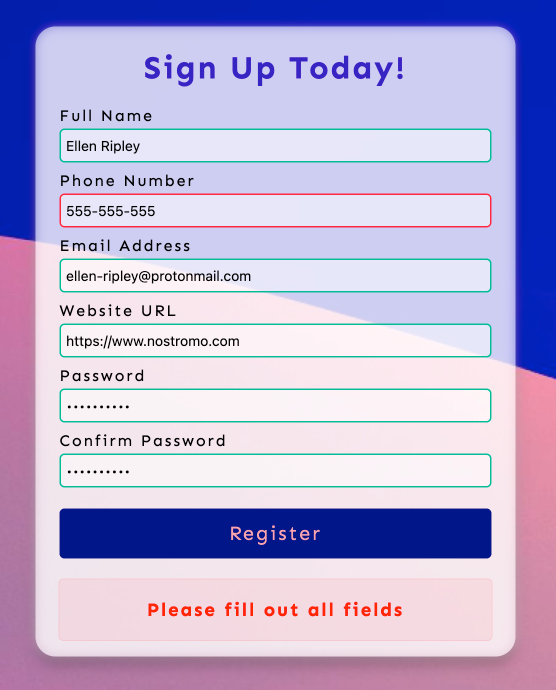
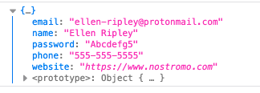

# Form Validator

A simple HTML & JavaScript form validator for a sign up page. It alerts if any data is filled in incorrectly or the passwords do not match. 

| Data was filled out incorrectly | Passwords do not match                |
| ------------------------------- | ------------------------------------- |
|    |  |

> The form generates an object that should be handled afterwards. 